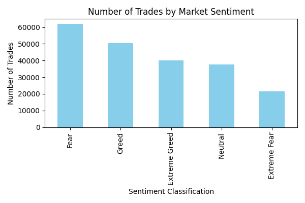
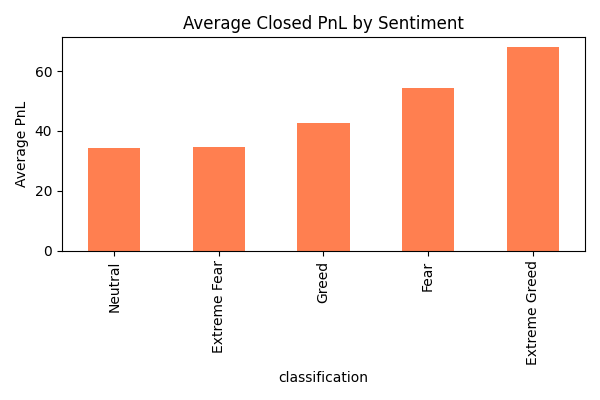
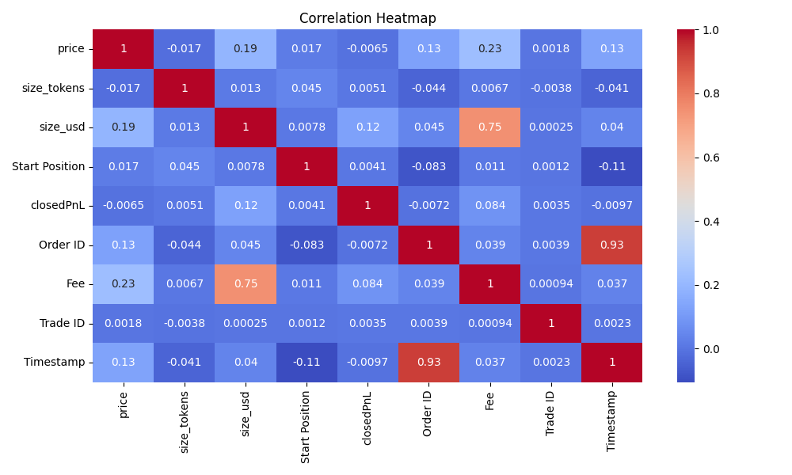
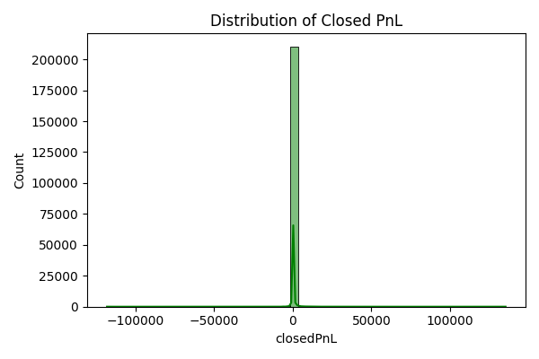
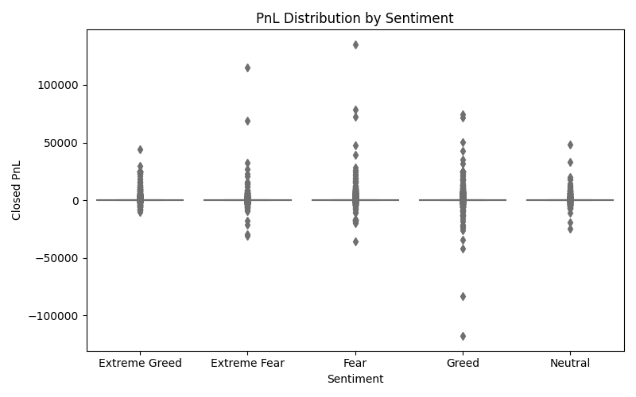
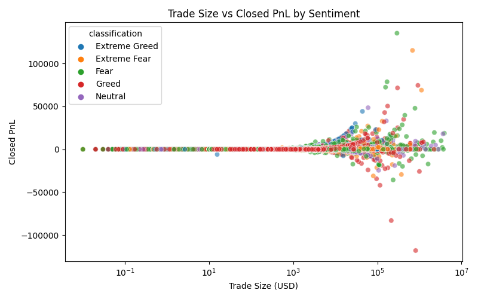
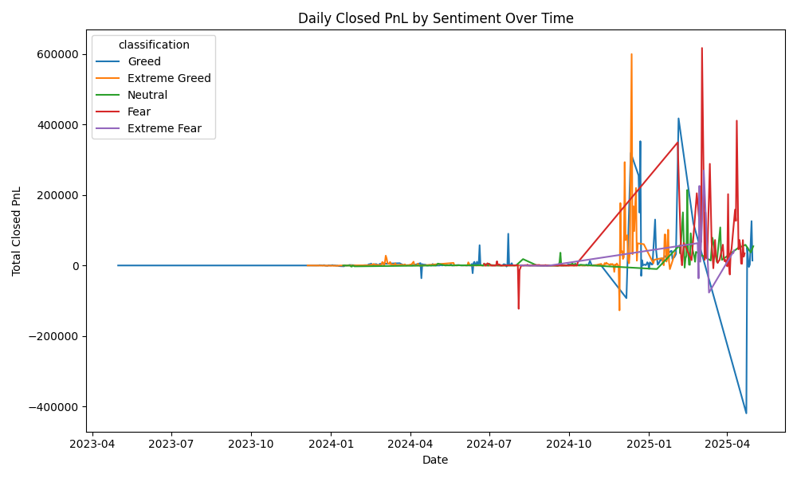

# 📊 Sentiment Trader Analysis – Yash Purohit

## 📌 Overview
This project analyzes the relationship between **Bitcoin market sentiment** (Fear & Greed Index) and **trader performance** using historical trading data from Hyperliquid.  
It examines how market mood impacts:
- 📈 Number of trades
- 💰 Average Profit & Loss (PnL)
- 📏 Trade sizes and outcomes
- 🔗 Correlations between trading metrics

Analysis is performed in **two Google Colab notebooks**:
1. **Notebook 1** – Data loading, cleaning, merging, and basic EDA.
2. **Notebook 2** – Advanced visualizations and deeper sentiment-based insights.

---

## 📂 Project Structure
ds_Yash-Purohit/
├── notebook_1.ipynb # Main Colab notebook – EDA & merging datasets
├── notebook_2.ipynb # Advanced analysis notebook
├── csv_files/ # All CSV datasets
│ ├── fear_greed_index.csv
│ ├── historical_data.csv
│ └── merged_data.csv
├── outputs/ # All generated charts & visuals
│ ├── trades_by_sentiment.png
│ ├── avg_pnl_by_sentiment.png
│ ├── correlation_heatmap.png
│ ├── closed_pnl_distribution.png
│ ├── pnl_boxplot_by_sentiment.png
│ ├── account_pnl_by_sentiment.png
│ ├── trade_size_vs_pnl.png
│ └── daily_pnl_by_sentiment.png
├── ds_report.pdf # Final project report
└── README.md # This file

yaml
Copy
Edit

---

## 🚀 Google Colab Notebooks
- 📒 **[Notebook 1 – Main EDA](YOUR_COLAB_LINK_1)**  
- 📒 **[Notebook 2 – Advanced Analysis](YOUR_COLAB_LINK_2)**  

> ⚠️ Open these in **Google Colab** for best viewing experience.

---

## 📊 Key Outputs

### 1️⃣ Number of Trades by Market Sentiment

### 2️⃣ Average Closed PnL by Sentiment

### 3️⃣ Correlation Heatmap

### 4️⃣ Distribution of Closed PnL

### 5️⃣ PnL Boxplot by Sentiment

### 6️⃣ Account PnL by Sentiment (Top 5)

### 7️⃣ Trade Size vs PnL

### 8️⃣ Daily PnL by Sentiment

---

## 📑 Report
📄 **[View Full Project Report (ds_report.pdf)](ds_report.pdf)**
